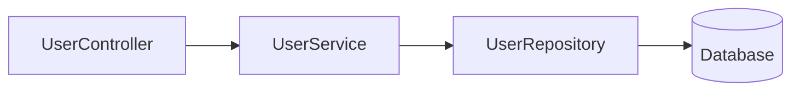

# 아키텍처 문서

## 계층 구조
요청은 Controller → Service → Repository 순서로만 흐른다.
Service는 DB에 직접 접근하지 않고 반드시 Repository를 거친다.

```mermaid
flowchart LR
    UserController --> UserService --> UserRepository --> DB[(Database)]
```
